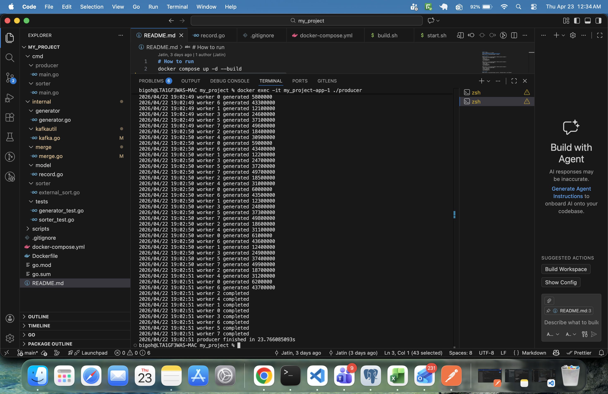
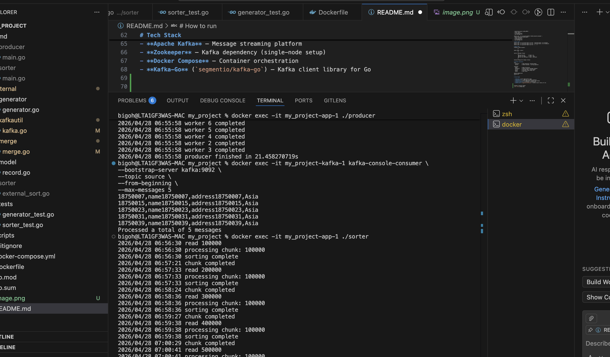

# How to run 
docker compose up -d --build
docker exec -it my_project-app-1 ./producer
docker exec -it my_project-app-1 ./sorter

# check results
docker exec -it my_project-kafka-1 kafka-console-consumer \
--bootstrap-server kafka:9092 \
--topic id \
--from-beginning \
--max-messages 10

docker exec -it my_project-kafka-1 kafka-console-consumer \
--bootstrap-server kafka:9092 \
--topic name \
--from-beginning \
--max-messages 10

docker exec -it my_project-kafka-1 kafka-console-consumer \
--bootstrap-server kafka:9092 \
--topic continent \
--from-beginning \
--max-messages 10

# Test cases
docker exec -it my_project-app-1 go test ./internal/tests -run TestSort
docker exec -it my_project-app-1 go test ./internal/tests -run TestRecord
docker exec -it my_project-app-1 go test ./... -v

# data flow
Producer (Multi-worker)
        │
        ▼
Kafka Topic: source
        │
        ▼
Sorter (Consumer Group)
        │
        ├── Sort by ID        → topic: id
        ├── Sort by Name      → topic: name
        └── Sort by Continent → topic: continent
        │
        ▼
External Merge Sort Output (files)

# Project Structure
cmd/
  producer/     → Data generator (worker-based)
  sorter/       → Kafka consumer + sorting pipeline

internal/
  model/        → Data structures
  kafkautil/    → Kafka producer/consumer helpers
  sorter/       → Sorting logic (chunk-based)
  merge/        → External k-way merge sort
  tests/        → Unit tests

docker-compose.yml
Dockerfile
---

# Tech Stack

- **Golang** – Core application logic
- **Apache Kafka** – Message streaming platform
- **Zookeeper** – Kafka dependency (single-node setup)
- **Docker Compose** – Container orchestration
- **Kafka-Go** (`segmentio/kafka-go`) – Kafka client library for Go

Producer Terminal Output
 : Producer
 :  Sorter

